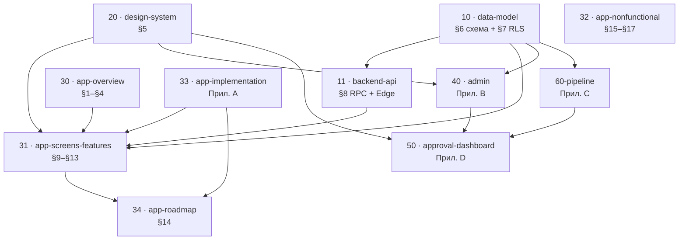

# SPEC (React Native) — Обучающее приложение по истории (геймификация) — RN9

> **RN9 (что изменилось vs RN8).** Апрувер конвейера перенесён в **админку** (Приложение B): один веб-проект на **React + shadcn/ui + Tailwind**, адаптивный под телефон. Убраны **Tailscale**, **Jinja2/HTMX** и любой туннель. Mac mini (конвейер) и админка общаются **только через Supabase** (таблицы `pipeline.*`); прямого соединения между ними нет. Единый дизайн на приложение + админку + апрувер — через одну палитру (§5).

> **Назначение документа.** Это технический спек для пошаговой разработки через Claude Code (spec-driven development), **переписанный под React Native**. Концепт продукта — в `concept.md`; этот файл переводит концепт в инженерные требования: схему данных, контракты API, структуру кода, навигацию, дизайн-токены и дорожную карту по фазам.
> 
> **Кросс-платформенность.** В отличие от предыдущей версии (нативный Android/Kotlin), приложение теперь **одно на двух платформах — iOS и Android** — на едином коде React Native. Каждое инженерное решение в этом документе учитывает обе платформы; платформенные различия (платежи, виджеты, sign-in, deep links, пуши, подписание, стор-листинги) проговариваются явно.
> 
> **Тестирование вынесено.** Из этого документа **намеренно удалено всё про тестирование** (unit/UI/SQL/smoke, TDD, Definition of Done в части тестов). Стратегия и требования к тестам описываются в отдельном файле.
> 
> **Как использовать.** Разработка идёт по фазам из раздела 14 строго по порядку. Каждая фаза имеет цель, задачи, артефакты (deliverables) и критерии приёмки (acceptance criteria). Не переходить к следующей фазе, пока критерии текущей не выполнены.
> 
> **Рабочее название:** `Lorebinge`. Android `applicationId` / iOS `bundleIdentifier`: `com.lorebinge.app`.
> 
> **Язык интерфейса:** английский. Язык кода/идентификаторов: английский. Язык этого документа: русский.

-----

## Оглавление (spec-driven разбиение)

> Этот спек разбит на тематические файлы для пошаговой разработки. Исходный
> [`spec-rn9.md`](spec-rn9.md) сохранён **как архив — не редактировать**. Нумерация
> разделов (§) и приложений сохранена без изменений, чтобы существующие
> перекрёстные ссылки внутри текста («см. §8», «§6», «(§5)») оставались валидными
> между файлами. Контент в файлах ниже — дословный; добавлена только
> навигационная шапка.

| Файл | Что внутри | Разделы исходника |
|---|---|---|
| [10-data-model.md](10-data-model.md) | Схема БД + RLS — единый контракт данных | §6, §7 |
| [11-backend-api.md](11-backend-api.md) | RPC-функции + Edge Functions | §8 |
| [20-design-system.md](20-design-system.md) | Дизайн-система (общая: app + admin + approver) | §5 |
| [30-app-overview.md](30-app-overview.md) | Обзор, стек, архитектура, структура репо | §1–§4 |
| [31-app-screens-features.md](31-app-screens-features.md) | Модели, навигация, server-driven UI, экраны, фичи + AC | §9–§13 |
| [32-app-nonfunctional.md](32-app-nonfunctional.md) | NFR, обработка ошибок, вне MVP | §15–§17 |
| [33-app-implementation.md](33-app-implementation.md) | Версии, секреты, механики, биллинг, DoD | Прил. A |
| [34-app-roadmap.md](34-app-roadmap.md) | Фазы разработки приложения (Phase 0–16) | §14 |
| [40-admin.md](40-admin.md) | Админ-панель целиком + B-Phase 1–7 | Прил. B |
| [50-approval-dashboard.md](50-approval-dashboard.md) | Дашборд очереди апрувов + D-Phase 1–3 | Прил. D |
| [60-pipeline.md](60-pipeline.md) | Контент-конвейер целиком (отдельный подпроект) | Прил. C |

> **Примечание.** Приложение C (конвейер) намеренно **не** вынесено из архива в
> отдельный новый файл: конвейер уже описан в существующем
> [`60-pipeline.md`](60-pipeline.md) — он и есть источник истины по
> этому подпроекту. Версия Приложения C внутри `spec-rn9.md` остаётся только в архиве.

### Граф зависимостей

Фундамент для всех подпроектов — **схема БД (§6) + RLS (§7)**: это Phase 1 дорожной
карты и общий контракт между приложением, админкой и конвейером.

Текстом (на случай, если mermaid не рендерится):

- **10 · data-model** — фундамент; зависит ни от чего, нужен всем.
- **11 · backend-api** ← 10 (RPC и Edge оперируют таблицами §6).
- **20 · design-system** — независим; общий для приложения, админки и апрувера.
- **30 · app-overview** — вводный контекст (стек/архитектура/структура).
- **31 · app-screens-features** ← 10, 11, 20, 30 (плюс уточнения механик из 33).
- **32 · app-nonfunctional** — сквозные требования к приложению.
- **33 · app-implementation** (Прил. A) — уточняет механики (батарея/стрик/алмазы/биллинг) для 31 и 34.
- **34 · app-roadmap** (§14) — фазы; Phase 1 = схема БД (10), фичи F1–F14 раскрыты в 31.
- **40 · admin** (Прил. B) ← 10 (читает/пишет `public.*` + `pipeline.*`), 20.
- **50 · approval-dashboard** (Прил. D) — раздел внутри админки (40); оркестрирует апрувы конвейера (Прил. C / 60-pipeline).
- **60-pipeline** (Прил. C) ← 10 (контракт — поля §6, импорт идемпотентно по `slug`).

### Карта перекрёстных ссылок (§ / приложение → файл)

При встрече ссылки вида «см. §N» или «Приложение X» внутри любого файла — искать здесь:

| Ссылка в тексте | Файл |
|---|---|
| §1, §2, §3, §4 | [30-app-overview.md](30-app-overview.md) |
| §5 | [20-design-system.md](20-design-system.md) |
| §6, §7 | [10-data-model.md](10-data-model.md) |
| §8 (в т.ч. «раздел 8.1») | [11-backend-api.md](11-backend-api.md) |
| §9, §10, §11, §12, §13 | [31-app-screens-features.md](31-app-screens-features.md) |
| §14 | [34-app-roadmap.md](34-app-roadmap.md) |
| §15, §16, §17 | [32-app-nonfunctional.md](32-app-nonfunctional.md) |
| Приложение A (A1–A14) | [33-app-implementation.md](33-app-implementation.md) |
| Приложение B (B1–B9, B-Phase) | [40-admin.md](40-admin.md) |
| Приложение C (C1–C8, C-Phase) | [60-pipeline.md](60-pipeline.md) |
| Приложение D (D1–D7, D-Phase) | [50-approval-dashboard.md](50-approval-dashboard.md) |
